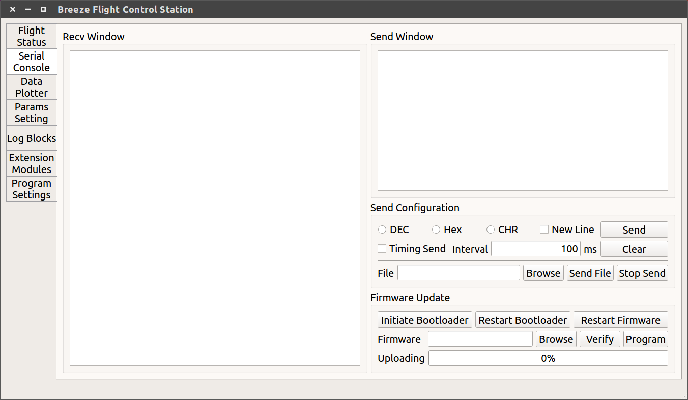
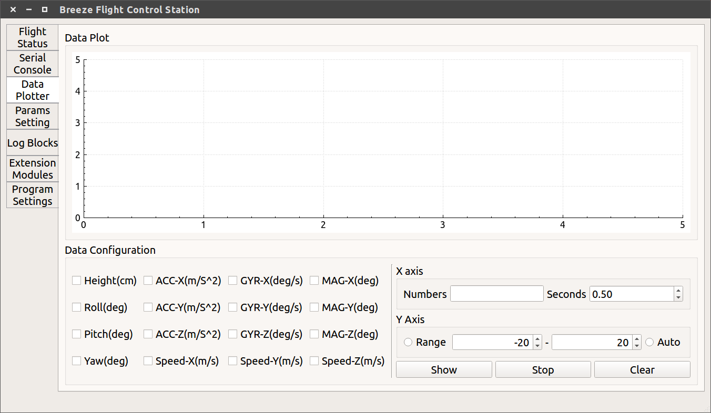
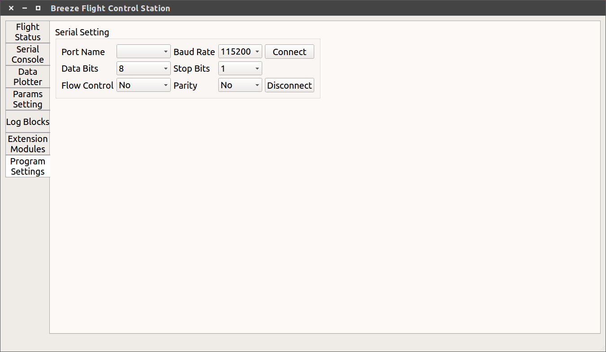

# breeze_flight_control_station

[](https://travis-ci.org/microdynamics-quadcopter/breeze_flight_control_station)   [](./LICENSE)   [](https://gitter.im/microdynamics-quadcopter/developer)

## Description

Breeze flight control station can implement real-time monitoring and control on the computer client.








## Requirment

- Ubuntu 16.04
- Qt 5.9
- GCC 5.4
- Boost 1.58

## Configuration

Install some dependent pacages:

```sh
$> sudo apt-get update
$> sudo apt-get install build-essential libboost-all-dev
```

Download the repository:

```sh
$> cd ~/Desktop
$> git clone https://github.com/microdynamics-quadcopter/breeze_flight_control_station.git
```

Build the codes:

```sh
$> cd ~/Desktop/breeze_flight_control_station
$> mkdir build; cd build
$> /opt/Qt5.9.1/5.9.1/gcc_64/bin/qmake ../breeze_flight_control_station.pro
$> make
```

## Usage

```sh
$> cd ~/Desktop/breeze_flight_control_station/build
$> ./breeze_flight_control_station
```
